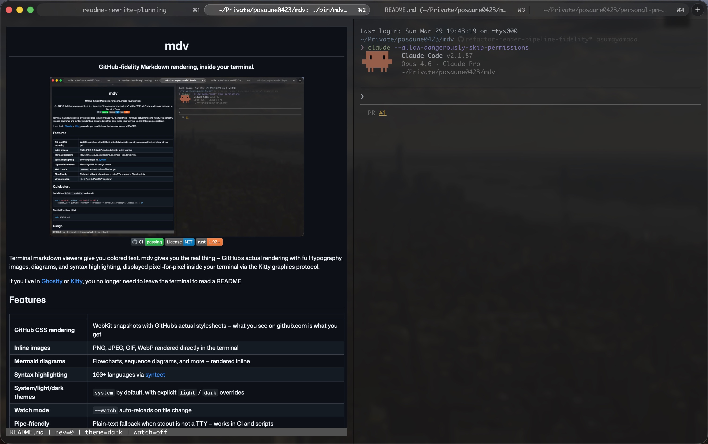

<div align="center">

# mdv

**GitHub-fidelity Markdown rendering, inside your terminal.**



[](https://github.com/posaune0423/mdv/actions/workflows/ci.yml)
[](./LICENSE)
[](https://www.rust-lang.org/)

</div>

Terminal markdown viewers give you colored text. mdv gives you the real thing — GitHub's actual rendering with full typography, images, diagrams, and syntax highlighting, displayed pixel-for-pixel inside your terminal via the Kitty graphics protocol.

If you live in [Ghostty](https://ghostty.org/) or [Kitty](https://sw.kovidgoyal.net/kitty/), you no longer need to leave the terminal to read a README.

## Features

| | |
|---|---|
| **GitHub CSS rendering** | WebKit snapshots with GitHub's actual stylesheets — what you see on github.com is what you get |
| **Inline images** | PNG, JPEG, GIF, WebP rendered directly in the terminal |
| **Mermaid diagrams** | Flowcharts, sequence diagrams, and more — rendered inline |
| **Syntax highlighting** | 100+ languages via [syntect](https://github.com/trishume/syntect) |
| **System/light/dark themes** | `system` by default, with explicit `light` / `dark` overrides |
| **Watch mode** | `--watch` auto-reloads on file change |
| **Pipe-friendly** | Plain-text fallback when stdout is not a TTY — works in CI and scripts |
| **Vim navigation** | `j`/`k`/`g`/`G`/PageUp/PageDown |

## Quick start

**Install** (into `$HOME/.local/bin` by default):

```bash
curl --proto '=https' --tlsv1.2 -LsSf \
  https://raw.githubusercontent.com/posaune0423/mdv/main/scripts/install.sh | sh
```

**Run** (in Ghostty or Kitty):

```bash
mdv README.md
```

## Usage

```bash
mdv README.md                            # system theme (default)
mdv --theme dark notes.md                # dark theme
mdv --watch docs/guide.md               # auto-reload on save
mdv --no-mermaid spec.md                # skip Mermaid rendering
mdv update                              # install the latest GitHub Release over this mdv binary
mdv ./CHANGELOG.md | head -n 50         # plain-text output (pipe/CI)
```

### Keyboard shortcuts

| Key | Action |
|-----|--------|
| `j` / `Down` | Scroll down |
| `k` / `Up` | Scroll up |
| `g` | Jump to top |
| `G` | Jump to bottom |
| `PageUp` / `PageDown` | Page scroll |
| `r` | Reload file |
| `o` | Open link in browser |
| `q` | Quit |

## Requirements

- **Terminal**: [Ghostty](https://ghostty.org/) or [Kitty](https://sw.kovidgoyal.net/kitty/) (Kitty graphics protocol required)
- **Rich rendering**: macOS (uses WebKit for HTML→PNG snapshots). Linux runs in headless/plain-text mode.
- **Mermaid** (optional): `mmdc` or `npx @mermaid-js/mermaid-cli`, or set `MDV_MERMAID_CMD`

## Installation

| Method | Command / notes |
|--------|-----------------|
| **Install script** | See [Quick start](#quick-start). Pin to a release tag: `…/vMAJOR.MINOR.PATCH/scripts/install.sh` |
| **GitHub Releases** | Download a prebuilt archive from [Releases](https://github.com/posaune0423/mdv/releases). Linux x86_64/arm64, macOS Intel/Apple Silicon. SHA256SUMS included. |
| **Homebrew** | `brew install mdv` (when available in [homebrew-core](https://github.com/Homebrew/homebrew-core)) |
| **mise** | `mise use -g github:posaune0423/mdv` |
| **Cargo** | `cargo install --path . --locked --force` or `make install-local` from a clone |

## Troubleshooting

| Symptom | What to try |
|---------|-------------|
| `mdv: command not found` | Ensure `$HOME/.local/bin` is on `PATH`, then restart the terminal. |
| `mdv update` fails | Confirm the current `mdv` location is writable and the host platform has a matching GitHub Release asset. |
| Plain text instead of rich viewer | Requires a TTY in Ghostty or Kitty. Pipes and redirects trigger headless mode by design. |
| Mermaid diagrams show placeholders | Install `mmdc` or use `npx @mermaid-js/mermaid-cli`. Use `--no-mermaid` to skip entirely. |
| Graphic / snapshot issues | Rich rendering uses WebKit (macOS only). See [docs/TECH.md](docs/TECH.md). |

## Documentation

- [llm.txt](llm.txt) — Agent-oriented install & CLI summary
- [GFM features & authoring](docs/MARKDOWN.md)
- [Architecture](docs/ARCHITECTURE.md)
- [Development & contributing](docs/DEVELOPMENT.md)
- [Changelog](CHANGELOG.md)

## Contributing

See [docs/DEVELOPMENT.md](docs/DEVELOPMENT.md). Run `make ci` before sending a PR.

## License

Released under the [MIT License](LICENSE).
