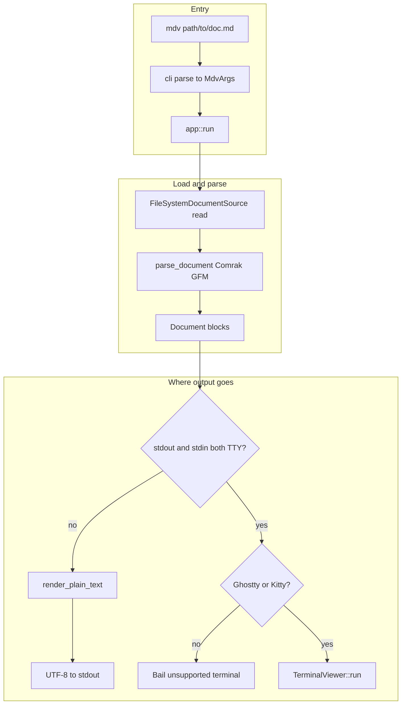
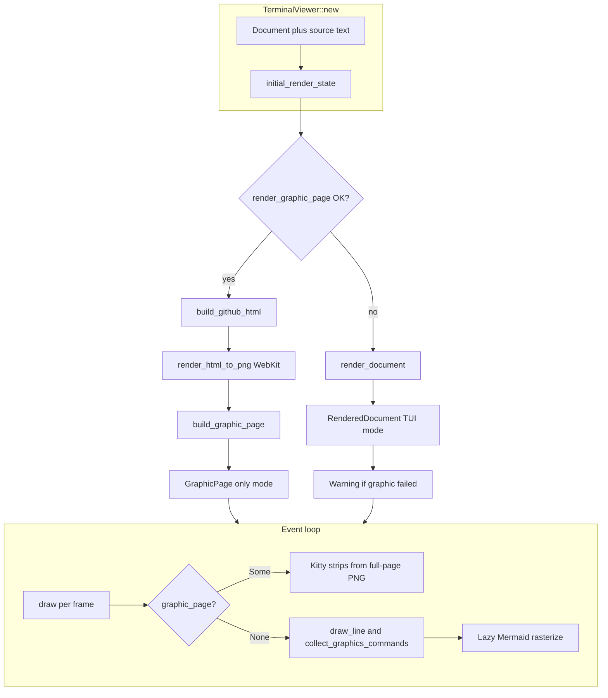
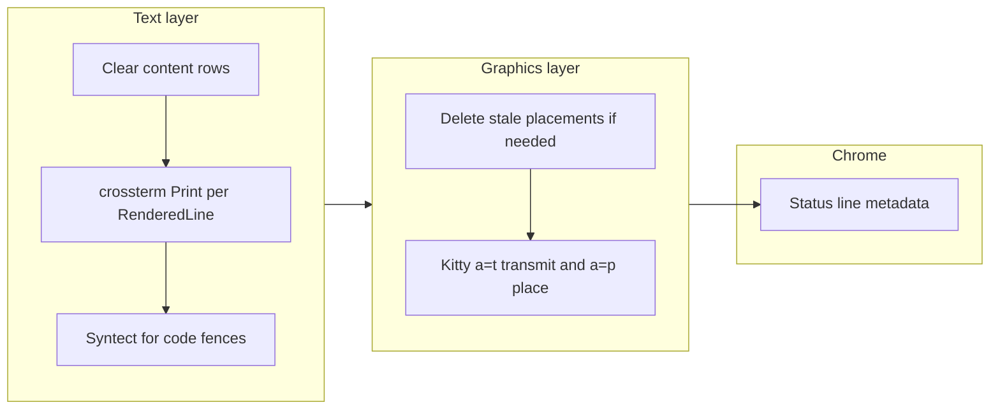

<div align="center">

# mdv

**High-fidelity Markdown viewer for [Ghostty](https://ghostty.org/) and [Kitty](https://sw.kovidgoyal.net/kitty/).**

[](https://github.com/posaune0423/mdv/actions/workflows/ci.yml)
[](./LICENSE)
[](https://www.rust-lang.org/)
[](https://doc.rust-lang.org/edition-guide/rust-2024/index.html)
[](https://doc.rust-lang.org/nomicon/safe-unsafe-meaning.html)

Render **[GitHub Flavored Markdown](https://github.github.com/gfm/)** in the terminal with rich typography, images, SVG, diagrams, and syntax-highlighted code blocks.

<br/>

</div>

---

## Markdown (GFM)

Authoring is meant to follow the **[GitHub Flavored Markdown Specification](https://github.github.com/gfm/)** (GFM). Parsing uses **[Comrak](https://github.com/kivikakk/comrak)**; enabled extensions mirror common GFM surface area:

| Extension | Notes |
|-----------|--------|
| **Strikethrough** | `~~text~~` |
| **Tables** | Pipe tables |
| **Autolink** | URLs and emails auto-linked where supported |
| **Task lists** | `- [ ]` / `- [x]` |
| **Footnotes** | Reference-style footnotes |
| **Alerts** | `> [!NOTE]`, `> [!TIP]`, etc. ([syntax](https://docs.github.com/en/get-started/writing-on-github/getting-started-with-writing-and-formatting-on-github/basic-writing-and-formatting-syntax#alerts)); blockquotes starting with `[!NOTE]`–style tags are also treated as callouts |

mdv also renders **fenced `mermaid` code blocks** (not part of GFM) when Mermaid is available. Raw HTML blocks are not rendered as HTML in the TUI; content is shown as plain text.

Exact edge-case behavior follows Comrak’s parser, not a formal proof of spec compliance—when in doubt, compare with the [GFM spec](https://github.github.com/gfm/) and Comrak’s release notes.

## Architecture

Rough module map:

| Layer | Role (in this repo) |
|-------|---------------------|
| **`main` / `cli`** | Parse argv → `MdvArgs` |
| **`app`** | Read file, parse Markdown once, branch interactive vs headless ([`src/app/mod.rs`](src/app/mod.rs)) |
| **`render::markdown`** | Comrak + GFM options → domain `Document` (`BlockKind` list) |
| **`render::text`** | `Document` → plain string **or** wrapped `RenderedDocument` (lines + graphic placements) |
| **`render::github_html`** | Same source → GitHub-style HTML (for snapshot / “graphic page” mode) |
| **`io`** | FS source, image decode, Mermaid CLI, WebKit HTML→PNG, Kitty graphics escape sequences |
| **`ui::terminal`** | Crossterm TTY, scroll/input loop, draw path ([`src/ui/terminal.rs`](src/ui/terminal.rs)) |
| **`ui::page_graphics`** | Slice a full-page PNG into terminal rows for Kitty placement |

### 1. End-to-end: `.md` file → terminal or stdout



Headless mode resolves images/Mermaid where possible but **never** opens the alternate screen or Kitty graphics.

### 2. Interactive viewer: two render modes

On startup, `TerminalViewer` calls `initial_render_state` ([`src/ui/terminal.rs`](src/ui/terminal.rs)): it **tries “graphic page” mode first** (GitHub-like HTML → rasterize → slice into rows). If that pipeline fails (e.g. WebKit snapshot unavailable), it **falls back** to the structured TUI: `render_document` builds per-line layout, Syntect-highlighted code, and per-block Kitty images.



`--watch` re-reads the file, re-parses with `parse_document`, and runs the same `initial_render_state` path again.

### 3. One frame: text grid + graphics protocol



Kitty / Ghostty receive ANSI escapes from **crossterm** for text and **custom escape sequences** (`io::kitty_graphics`) for images. On exit, the viewer leaves alternate screen and sends a delete-all-placements command so the shell is left clean.

In **GraphicPage** mode the text loop has no `RenderedDocument` lines to paint; the viewport is driven almost entirely by the Kitty strip placements from the snapshot PNG.

## Features

| Area | Details |
|------|---------|
| **Markdown** | GFM-oriented parsing via Comrak (see [Markdown (GFM)](#markdown-gfm))—headings, lists, tables, task lists, footnotes, alerts / callouts, links, images, thematic breaks |
| **Code** | Syntax highlighting powered by [Syntect](https://github.com/trishume/syntect) |
| **Assets** | PNG, JPEG, GIF, WebP, and SVG rendering where the terminal supports it |
| **Diagrams** | [Mermaid](https://mermaid.js.org/) diagrams (optional `--no-mermaid` to disable) |
| **Themes** | `light` / `dark` (`--theme`) |
| **Workflow** | `--watch` reloads when the file changes on disk |
| **CI / Pipes** | Non-interactive use prints a plain-text rendering to stdout |

## Requirements

- **Interactive TUI**: Ghostty or Kitty (`TERM_PROGRAM` / terminal detection). Other terminals get a clear error in interactive mode.
- **Rust toolchain**: **1.92+** (matches CI; edition 2024) — only if you build from source (see `cargo install` below).

## Installation

Prebuilt binaries are attached to [GitHub Releases](https://github.com/posaune0423/mdv/releases) (Linux x86_64 / Linux arm64 / macOS Intel / macOS Apple Silicon). Each archive contains a single `mdv` executable at the top level.

### curl (recommended for end users)

Install into `$HOME/.local/bin` (override with `MDV_INSTALL_DIR`):

```bash
curl --proto '=https' --tlsv1.2 -LsSf \
  https://raw.githubusercontent.com/posaune0423/mdv/main/scripts/install.sh | sh
```

Pin to a release tag instead of `main` when you want a fixed installer revision:

```text
https://raw.githubusercontent.com/posaune0423/mdv/v0.1.0/scripts/install.sh
```

Verify checksums when you need supply-chain guarantees: every release publishes `SHA256SUMS` next to the archives.

### Homebrew

You **do not** need a `Formula/` directory in this repository.

- **`brew install mdv` (official core)**  
  The formula lives in [Homebrew/homebrew-core](https://github.com/Homebrew/homebrew-core). Once accepted, you can install with `brew install mdv` alone—nothing needs to live in this repository.

- **Third-party tap**  
  Before core inclusion or for custom distribution, put only `Formula/mdv.rb` in a separate repository (e.g. `posaune0423/homebrew-tap`) and have users point at the **tap repository** with `brew tap posaune0423/tap`. Keeping taps separate from the main app repository is common.

### mise

Install straight from GitHub Releases using the built-in `github` backend (zero extra plugins):

```bash
mise use -g github:posaune0423/mdv
```

To type `mise install mdv` / `mise use -g mdv@latest`, register a short name once in `~/.config/mise/config.toml`:

```toml
[tool_alias]
mdv = "github:posaune0423/mdv"
```

Upstream registry support (so `mise install mdv` works without `tool_alias`) is tracked in the [mise](https://github.com/jdx/mise) / [registry](https://github.com/jdx/mise/blob/main/registry.toml) project—contributions welcome.

### Build from source (Cargo)

```bash
cargo install --path . --locked --force
# or
make install-local
```

Binary name: `mdv`.

## Usage

```bash
# Open a file (default theme: light)
mdv README.md

# Dark theme + live reload
mdv --theme dark --watch ./docs/guide.md

# Disable Mermaid (placeholders only)
mdv --no-mermaid notes.md
```

**Pipelines** — when stdout is not a TTY (e.g. redirected or in CI), `mdv` writes a plain-text view instead of opening the interactive viewer:

```bash
mdv ./CHANGELOG.md | head -n 50
```

## Changelog

Release notes and version history live in [CHANGELOG.md](./CHANGELOG.md).

## Contributing

Issues and pull requests are welcome. Please run `make ci` before opening a PR so formatting, Clippy, and tests match what GitHub Actions enforces.

### Releases

Versioning is **Cargo-first**: update `Cargo.toml` and [CHANGELOG.md](./CHANGELOG.md), then create and push an annotated tag `vMAJOR.MINOR.PATCH`. [`.github/workflows/release.yml`](.github/workflows/release.yml) builds archives and attaches them to a GitHub Release for that tag.

### Contributors

Everyone who lands a change shows up automatically on the [GitHub contributors graph](https://github.com/posaune0423/mdv/graphs/contributors). Thank you for helping improve mdv.

## Development

Repository root includes a small `./mdv` shell helper that rebuilds the debug binary when sources change, then runs `target/debug/mdv`.

```bash
chmod +x ./mdv   # once, if needed
./mdv ./some.md
```

Quality gates (same as CI):

```bash
make ci    # fmt-check, clippy -D warnings, full test suite
```

| Command | Purpose |
|---------|---------|
| `make fmt` / `make fmt-check` | `rustfmt` |
| `make lint` | `clippy` with warnings denied |
| `make test` | All tests |
| `make test-unit` / `test-integration` / `test-e2e` | Split suites |

## License

mdv is licensed under the **MIT License**. See [LICENSE](./LICENSE) for the full text.

```text
MIT License

Copyright (c) 2026 mdv contributors

Permission is hereby granted, free of charge, to any person obtaining a copy
of this software and associated documentation files (the "Software"), to deal
in the Software without restriction, including without limitation the rights
to use, copy, modify, merge, publish, distribute, sublicense, and/or sell
copies of the Software, and to permit persons to whom the Software is
furnished to do so, subject to the following conditions:

The above copyright notice and this permission notice shall be included in all
copies or substantial portions of the Software.

THE SOFTWARE IS PROVIDED "AS IS", WITHOUT WARRANTY OF ANY KIND, EXPRESS OR
IMPLIED, INCLUDING BUT NOT LIMITED TO THE WARRANTIES OF MERCHANTABILITY,
FITNESS FOR A PARTICULAR PURPOSE AND NONINFRINGEMENT. IN NO EVENT SHALL THE
AUTHORS OR COPYRIGHT HOLDERS BE LIABLE FOR ANY CLAIM, DAMAGES OR OTHER
LIABILITY, WHETHER IN AN ACTION OF CONTRACT, TORT OR OTHERWISE, ARISING FROM,
OUT OF OR IN CONNECTION WITH THE SOFTWARE OR THE USE OR OTHER DEALINGS IN THE
SOFTWARE.
```

<div align="center">

<br/>

<sub>MIT © <a href="https://github.com/posaune0423/mdv/graphs/contributors">mdv contributors</a></sub>

</div>
