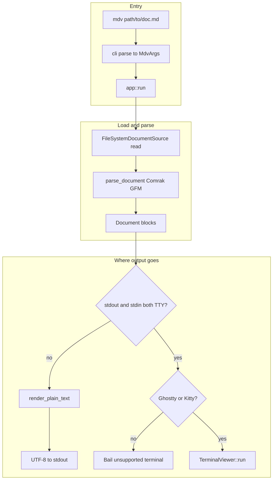
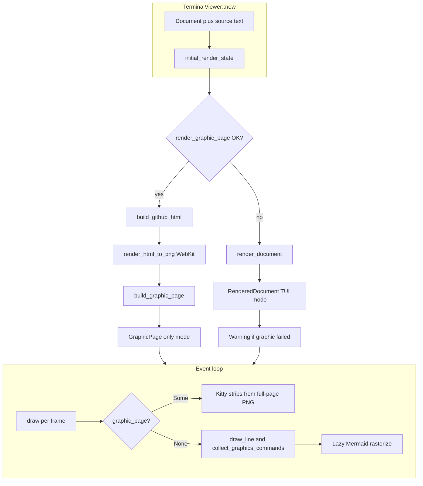
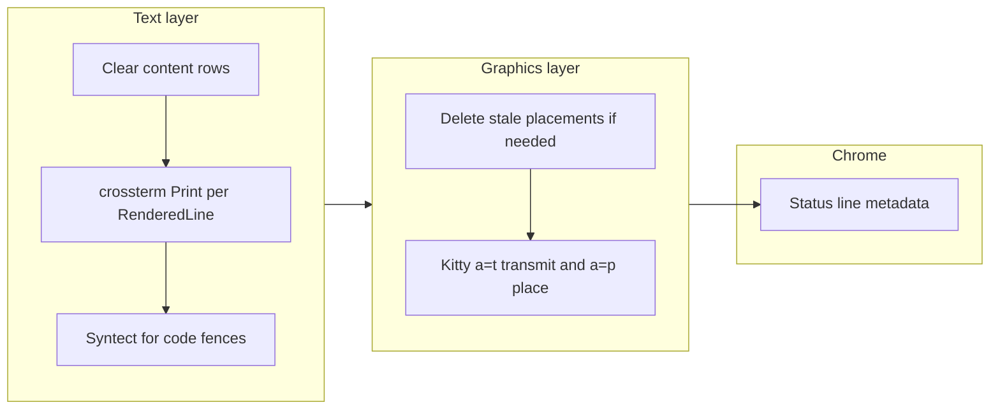

# Architecture

High-level map of how a `.md` file becomes terminal output or stdout in this repository.

## Module map

| Layer | Role (in this repo) |
|-------|---------------------|
| **`main` / `cli`** | Parse argv → `MdvArgs` |
| **`app`** | Read file, parse Markdown once, branch interactive vs headless ([`src/app/mod.rs`](../src/app/mod.rs)) |
| **`render::markdown`** | Comrak + GFM options → domain `Document` (`BlockKind` list) |
| **`render::text`** | `Document` → plain string **or** wrapped `RenderedDocument` (lines + graphic placements) |
| **`render::github_html`** | Same source → GitHub-style HTML (for snapshot / “graphic page” mode) |
| **`io`** | FS source, image decode, Mermaid CLI, WebKit HTML→PNG, Kitty graphics escape sequences |
| **`ui::terminal`** | Crossterm TTY, scroll/input loop, draw path ([`src/ui/terminal.rs`](../src/ui/terminal.rs)) |
| **`ui::page_graphics`** | Slice a full-page PNG into terminal rows for Kitty placement |

## 1. End-to-end: `.md` file → terminal or stdout

Headless mode resolves images/Mermaid where possible but **never** opens the alternate screen or Kitty graphics.

## 2. Interactive viewer: two render modes

On startup, `TerminalViewer` calls `initial_render_state` ([`src/ui/terminal.rs`](../src/ui/terminal.rs)): it **tries “graphic page” mode first** (GitHub-like HTML → rasterize → slice into rows). If that pipeline fails (e.g. WebKit snapshot unavailable), it **falls back** to the structured TUI: `render_document` builds per-line layout, Syntect-highlighted code, and per-block Kitty images.

`--watch` re-reads the file, re-parses with `parse_document`, and runs the same `initial_render_state` path again.

## 3. One frame: text grid + graphics protocol

Kitty / Ghostty receive ANSI escapes from **crossterm** for text and **custom escape sequences** (`io::kitty_graphics`) for images. On exit, the viewer leaves alternate screen and sends a delete-all-placements command so the shell is left clean.

In **GraphicPage** mode the text loop has no `RenderedDocument` lines to paint; the viewport is driven almost entirely by the Kitty strip placements from the snapshot PNG.

## See also

- [`TECH.md`](./TECH.md) — deeper technical notes and constraints (internal doc, partly in Japanese).
