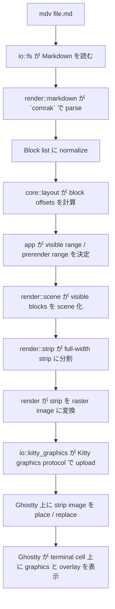
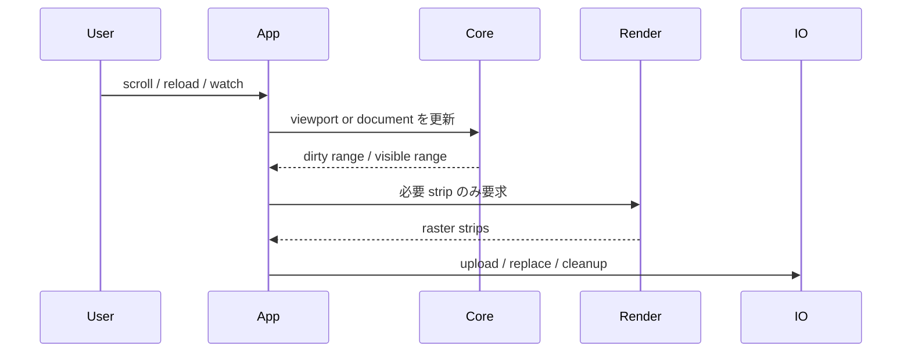
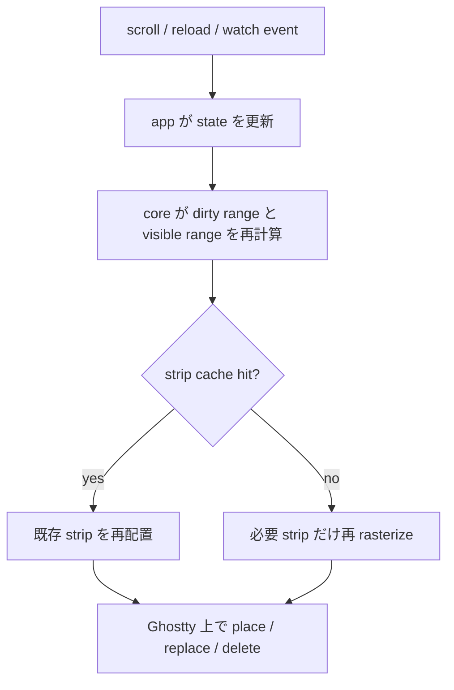

# PRD: `mdv` MVP

| Item | Value |
| --- | --- |
| Version | 0.2 |
| Status | Draft |
| Owner | Asuma |
| Product | `mdv` |
| Type | Rust 製 CLI Markdown Viewer |
| Primary Platform | macOS / Linux |
| Primary Terminal | Ghostty / Kitty |
| Release Target | MVP |

---

## 1. 概要

`mdv` は、ローカル Markdown ファイルを **terminal から離れずに、高 fidelity で閲覧するための Rust 製 viewer** である。

MVP では次の体験を提供する。

- `mdv README.md` で即座に開ける
- README / 設計書 / 仕様書を browser なしで読める
- GitHub Flavored Markdown で日常的に使う構文を実用レベルで扱える
- `--watch` により編集結果を素早く確認できる

---

## 2. 解く課題

既存の terminal 向け Markdown viewer は、次のいずれかで不足しやすい。

| 課題 | 具体例 |
| --- | --- |
| 表現力不足 | Mermaid, callout, 複雑な table, 画像が崩れる |
| fidelity 不足 | GitHub / VSCode preview に比べて視認性が低い |
| 運用コスト | browser や editor preview を別に開く必要がある |

`mdv` はこのギャップを埋め、**terminal 常用者が Markdown 文書を terminal 内で完結して読める状態** を目指す。

---

## 3. プロダクト目標

### 3.1 Primary Goal

**Ghostty / Kitty 上で、日常利用できる高 fidelity Markdown viewer を成立させること。**

### 3.2 Success Criteria

- README や設計 docs を実用的に読める
- scroll / reload / watch が普段使いできる速度で動く
- Mermaid / callout / table / image が viewer 全体を壊さずに表示される
- terminal 常用者が browser を開く頻度を下げられる

---

## 4. ターゲットユーザー

### 4.1 Primary User

- Ghostty / Kitty を使うソフトウェアエンジニア
- Markdown で README / design doc / spec を読む人
- terminal ワークフローを保ちたい開発者

### 4.2 Secondary User

- CLI ツール中心で作業する技術者
- browser preview を頻繁に行き来したくない人
- GitHub / VSCode に近い見た目を terminal に求める人

---

## 5. 代表ユースケース

| # | Use Case | Outcome |
| --- | --- | --- |
| 1 | `README.md` を terminal で読む | browser を開かずに内容確認できる |
| 2 | Mermaid を含む設計書を確認する | 図が大きく崩れず読める |
| 3 | `--watch` で docs を編集しながら preview する | 更新の確認が速い |
| 4 | GitHub Alerts / Callout を含む技術文書を読む | 注意喚起が視覚的に伝わる |
| 5 | 画像付きドキュメントを terminal 内でざっと見る | viewer を切り替えずに済む |

---

## 6. プロダクト原則

1. **fidelity 優先**
2. **CLI first**
3. **block-oriented**
4. **visible-first**
5. **browser 化しない**

---

## 7. MVP スコープ

### 7.1 含める機能

#### 入力

- ローカル file path
- `.md`, `.markdown`

#### 表示対応

| Category | Scope |
| --- | --- |
| Text | heading, paragraph, emphasis, strong, inline code |
| Block | code fence, blockquote, ordered/unordered list, task list, strikethrough |
| Rich block | table, image, horizontal rule, footnote, callout |
| Diagram | Mermaid |
| Links | inline link 表示、外部ブラウザ起動 |

MVP では parse layer に GFM 対応 parser を使い、README / 設計 docs で頻出する GFM 構文を優先的に render する。
raw HTML の完全互換はスコープ外とする。

#### 基本操作

- viewer 起動
- 縦スクロール
- top / bottom 移動
- reload
- watch mode
- quit
- 外部リンクを既定ブラウザで開く

#### テーマ

- `light`
- `dark`

#### 対応環境

- Ghostty
- Kitty
- macOS
- Linux
- direct terminal session

### 7.2 明示的に除外する機能

- tmux / zellij 正式対応
- multi-tab
- 編集機能
- 検索 UI
- TOC panel
- PDF export
- custom CSS
- remote image fetch
- arbitrary HTML/JS 実行
- Windows 対応

### 7.3 P1 候補

- Search
- TOC panel
- Anchor jump
- Code block copy
- Improved selection / copy
- Math support
- tmux compatibility

---

## 8. Mermaid と degraded policy

Mermaid は MVP 対象に含めるが、環境差で renderer が使えない場合に viewer 全体を壊さないことを優先する。

そのため user-visible な仕様は次の通りとする。

- Mermaid renderer が使える環境では図として表示する
- renderer が使えない場合は placeholder block と理由を表示する
- Mermaid failure は block 局所の失敗として扱い、viewer 全体は継続する

---

## 9. 実装方針

### 9.1 モジュール方針

`mdv` は strict clean architecture ではなく、**viewer に自然な `core / render / app / io / ui / cli` 構成** で実装する。

| Module | Responsibility |
| --- | --- |
| `core` | `Document`, `Block`, `Viewport`, `LayoutIndex`, `BlockDiff` などの純粋ロジック |
| `render` | Markdown 正規化、scene build、text layout、strip planning |
| `app` | 起動、scroll、reload、resize、watch の orchestration |
| `io` | file read、watcher、kitty graphics、Mermaid command、image decode |
| `ui` | event loop、overlay、screen lifecycle |
| `cli` | 引数解釈と初期 config 構築 |

### 9.2 実装パイプライン


実装上の要点は以下である。

- parser は GFM 対応 parser を使う
- 文書は block-oriented に保持する
- 再描画単位は全文ではなく visible strip に限定する
- scroll / watch / reload では dirty range だけ再計算する
- Mermaid は adapter 経由で描画し、失敗時は degraded block に落とす

### 9.3 Ghostty 上での rendering flow



Ghostty 上では text をそのまま大量に描くのではなく、**visible な Markdown block を strip 画像へ変換して graphics protocol で置く**、という流れになる。

### 9.4 testability 方針

すべてを trait で抽象化しない。**変動しやすく test double の価値が高い境界だけ trait 化する。**

| Boundary | Why |
| --- | --- |
| filesystem | fixture / temp file 差し替えが容易 |
| watcher | debounce と event 制御を test しやすい |
| graphics surface | dry-run surface で render plan を検証できる |
| Mermaid renderer | renderer 有無を test で切り替えられる |

`layout`, `diff`, `scene build`, `strip planning` は pure logic と snapshot test で担保する。

---

## 10. 内部設計サマリ

### 10.1 主要データ構造

| Type | Role |
| --- | --- |
| `Document` | 単一 Markdown 文書の全体状態 |
| `Block` | 見出し、段落、表、Mermaid などの最小描画単位 |
| `Viewport` | 現在の可視領域 |
| `LayoutIndex` | block ごとの開始位置と全文書高さ |
| `StripKey` | strip cache / graphics placement のキー |
| `BlockDiff` | reload 時に dirty range を求める差分 |

### 10.2 更新モデル



### 10.3 scroll / reload 時の再描画フロー



### 10.4 フォールバック規則

- Mermaid render failure は block 単位の degraded 表示
- image decode failure は placeholder block
- unsupported terminal は fail fast
- watch / reload failure は overlay で通知し viewer 継続

---

## 11. Repository Structure

```text
src/
├─ cli/
├─ app/
├─ core/
├─ render/
├─ io/
├─ ui/
├─ ports/
└─ support/

tests/
├─ unit/
├─ integration/
├─ e2e/
├─ fixtures/
└─ snapshots/
```

この構成により、`core` と `render` は pure test と snapshot test、`io` は integration / e2e で検証しやすくなる。

---

## 12. CLI UX

### 12.1 起動例

```bash
cargo install --path . --force
mdv README.md
mdv docs/spec.md --watch
mdv docs/spec.md --theme dark
mdv docs/spec.md --no-mermaid
```

### 12.2 操作

| Action | Default |
| --- | --- |
| Scroll down | `j`, `Down` |
| Scroll up | `k`, `Up` |
| Page down | `PageDown` |
| Page up | `PageUp` |
| Top | `g` |
| Bottom | `G` |
| Reload | `r` |
| Quit | `q` |

---

## 13. 非目標

MVP では以下を目指さない。

- browser 並みの HTML/CSS/JS 互換
- あらゆる terminal への最適化
- 汎用 web browser 的な navigation
- plugin system
- remote document viewer
- editor 化

---

## 14. 成功指標

| Metric | Target |
| --- | --- |
| First Visible Paint | `<= 500ms` |
| Scroll latency p95 | `<= 33ms` |
| Watch update latency p95 | `<= 150ms` for non-Mermaid |
| Mermaid update latency p95 | `<= 700ms` |
| Crash-free session | docs 閲覧用途で実用水準 |

---

## 15. リスク

| Risk | Impact | Mitigation |
| --- | --- | --- |
| Mermaid renderer 依存 | 環境差で図が描けない | degraded block を正式仕様にする |
| terminal 差異 | Ghostty / Kitty 外で崩れる | MVP は正式サポートを絞る |
| strip cache 調整不足 | スクロール体感が悪化 | metrics と fixture で計測する |
| table / image の複雑さ | レイアウト崩れ | viewer 全体を壊さず block 単位 fallback |

---

## 16. 受け入れ条件

以下を満たしたら MVP を受け入れ可能とする。

- `mdv README.md` が Ghostty / Kitty で起動できる
- heading / code / table / callout / image / mermaid が破綻せず表示される
- `--watch` が日常利用に耐える
- format / lint / test の CI が通る
- fatal error と block 局所 failure が分離されている

---

## 17. 補足

技術設計、crate 選定、データ構造、フォルダ構成は [`docs/plan/init.md`](./plan/init.md) を正とする。
