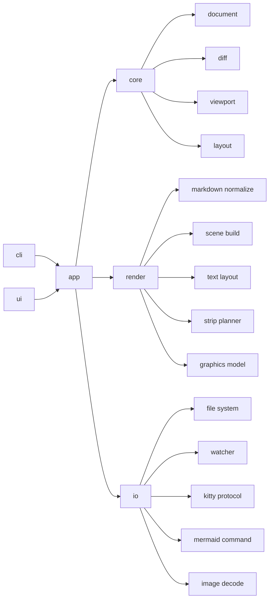
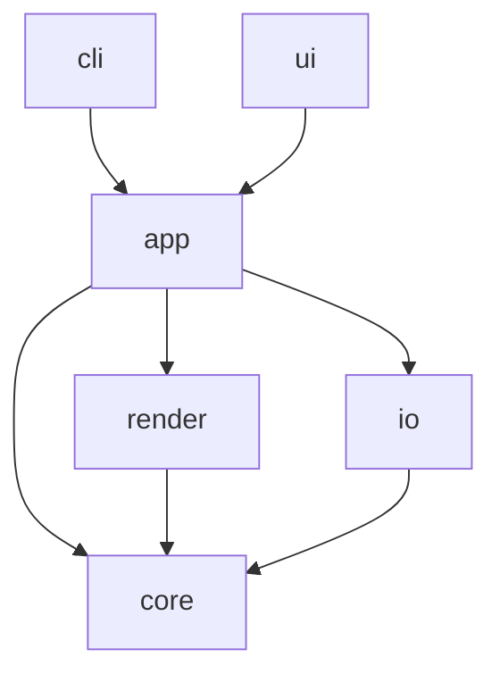
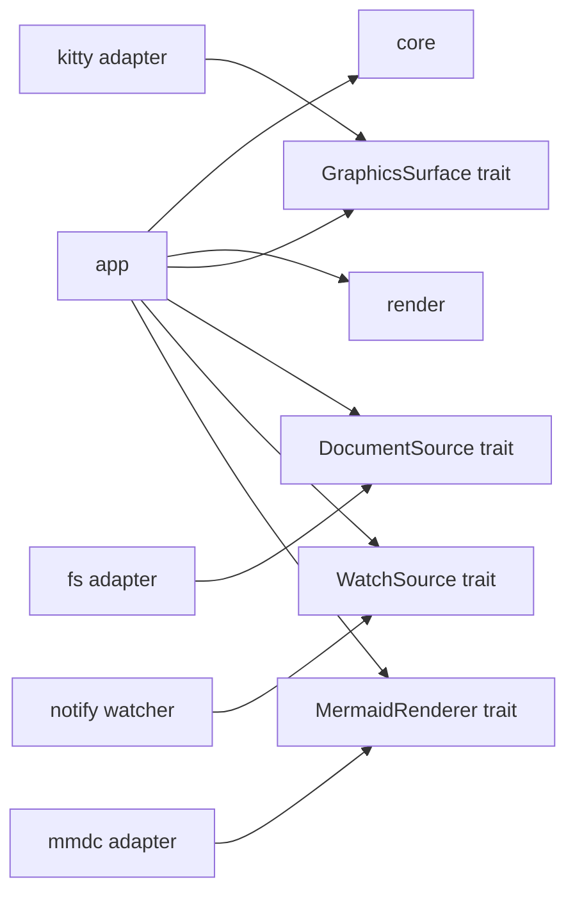
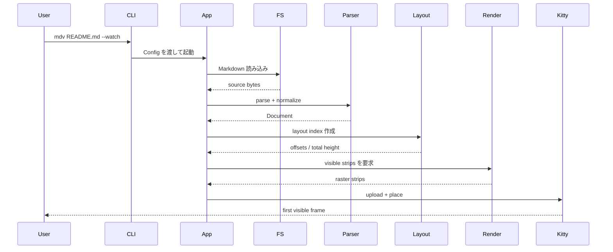
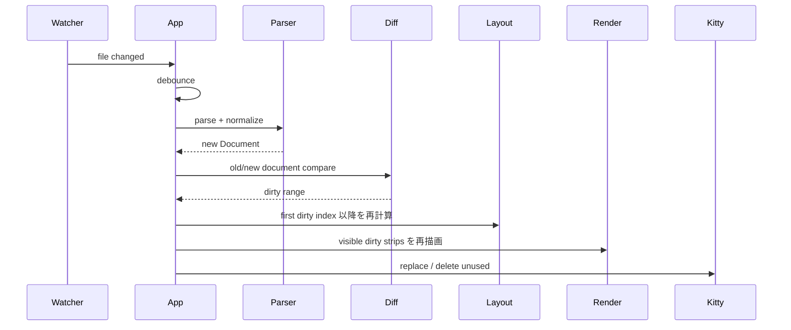
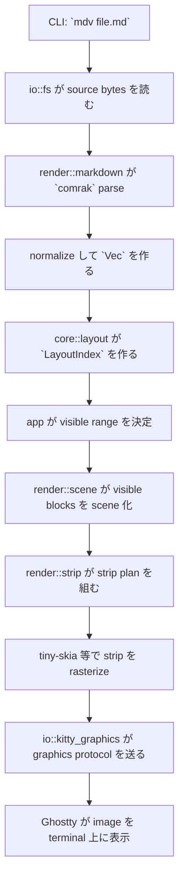
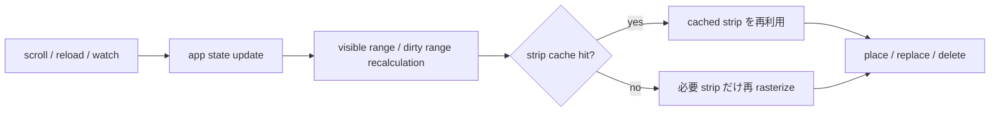
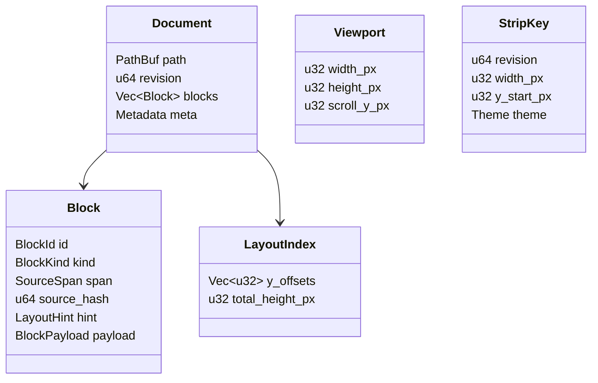

# `mdv` 初期開発設計書

| Item | Value |
| --- | --- |
| Version | 0.3 |
| Status | Draft |
| Owner | Asuma |
| Product | `mdv` |
| Language | Rust |
| Primary Runtime | Single binary, single interactive process |
| Primary Platforms | macOS / Linux |
| Primary Terminals | Ghostty / Kitty |
| Related Doc | [`docs/PRD.md`](../PRD.md) |

---

## 1. この文書の目的

この文書は、`mdv` の **MVP 実装を着手できる粒度まで具体化した技術設計書** である。

`docs/PRD.md` が扱うのは以下である。

- 何を作るか
- どのユーザーのどの課題を解くか
- MVP のスコープをどこまでに絞るか

この文書が扱うのは以下である。

- どう実装するか
- どの crate / tool を採用するか
- どのデータ構造と責務分離で進めるか
- どの順序で実装するか

---

## 2. 設計要約

`mdv` は、ローカル Markdown を **block-oriented に正規化し、visible-first に strip rasterize して、Kitty graphics protocol で表示する Rust 製 viewer** として実装する。

MVP の核は次の 6 点である。

1. Markdown を `comrak` で AST 化し、独自 `Block` モデルへ正規化する。
2. 文書を paragraph / heading / code / table / image / mermaid などの block 列として保持する。
3. block 列から block layout と strip 単位の render plan を作る。
4. visible range とその周辺だけを raster 化する。
5. 生成した strip を Kitty graphics protocol で差分表示する。
6. `watch` / `reload` 時は dirty block 以降だけを再レイアウトし、必要 strip のみ再描画する。

---

## 3. 設計判断

### 3.1 主要 ADR

| Topic | Decision | Why |
| --- | --- | --- |
| 実行形態 | 単一バイナリ、単一対話プロセス | 運用・配布・デバッグを簡単にする |
| モジュール構成 | strict clean architecture ではなく pragmatic modular layering | `markdown` / `graphics` / `render` は製品の中心能力であり、単なる infrastructure ではない |
| レンダリング戦略 | custom scene renderer + strip rasterization | Rust 単体で実装可能、レイアウトが決定的、差分更新しやすい |
| 文書モデル | block-oriented | diff / reload / cache の単位を安定化できる |
| 表示単位 | full-width vertical strip | 縦スクロール主体の viewer と相性が良い |
| 優先順位 | visible-first | 体感速度を最優先にできる |
| Mermaid | adapter 抽象化し、利用可能な renderer があれば SVG 化。なければ degraded 表示 | Mermaid でコア実装を止めないため |

### 3.2 旧案からの変更点

以前の設計案では「HTML fragment をまとめて rasterize」する方針が強かったが、MVP では採用しない。

理由は以下である。

- Rust 単体で HTML/CSS を高 fidelity に rasterize する実装難度が高い
- HTML/CSS エンジンを抱えると single-binary 方針とコンパイルコストが悪化する
- viewer に必要なのは browser 互換ではなく、Markdown block を安定描画できること

そのため MVP では、**Markdown を custom scene model に正規化し、text / code / box / image を直接レイアウトする** 方が合理的である。

### 3.3 Clean Architecture をどこまで採るか

結論として、`mdv` では **strict clean architecture は採らない**。

理由は以下である。

- `markdown parse` は外側の補助機能ではなく、viewer の中心能力そのもの
- `graphics` と `rasterize` も、この製品では domain に準ずる中核ロジックに近い
- 無理に `infrastructure` に押し込むと、かえってフォルダ構成の意味が薄れる
- viewer は web app や業務 CRUD と違い、描画パイプライン自体が主役である

一方で testability の観点から、**変動しやすい境界だけは trait で切る**。

trait 化する候補は以下。

- filesystem read
- file watch
- terminal graphics surface
- external Mermaid command execution

逆に、最初から trait を強制しない領域は以下。

- block normalize
- layout / diff
- scene build
- strip planning
- text layout orchestration

つまり方針は、**構成は pragmatic、境界は selective abstraction** である。

---

## 4. アーキテクチャ概要

### 4.1 論理構成



### 4.2 依存方向



依存ルールは次の通り。

- `core` は文書モデル、diff、viewport、layout などの純粋ロジックを持つ
- `render` は `mdv` の中核であり、Markdown 正規化と strip 描画計画を持つ
- `io` は file / watcher / external command / terminal graphics などの接続を持つ
- `app` は scroll / reload / resize / watch を調停する
- `ui` は terminal event と overlay を扱う
- `cli` は設定入力を担う

### 4.3 testability のための境界

以下のように、**テスト価値が高いところだけ port 的抽象を入れる**。



---

## 5. 参考実装

既存実装はそのまま写経せず、**何を参考にし、何を持ち込まないか** を明確にする。

| Project | 参考にする点 | 採用しない点 |
| --- | --- | --- |
| `awrit` | Kitty graphics protocol の扱い、image lifecycle、terminal 上の graphics cleanup | full browser 前提の責務、web navigation、DOM アプリ向けの複雑な event model |
| `flint` | Markdown viewer としての UX、Mermaid / image / table / callout を重視する姿勢、`j/k` などの操作系 | Textual 前提の widget tree、Python runtime 前提の構造 |

このプロジェクトでの位置づけは次の通り。

- `awrit` は **graphics adapter の参照先**
- `flint` は **viewer UX と feature prioritization の参照先**
- `mdv` 自身は Rust 製 single-binary viewer として別解を取る

---

## 6. 実行シーケンス

### 6.1 起動から初回描画まで



### 6.2 `watch` 更新時



### 6.3 Ghostty rendering flow



このとき Ghostty 上に出るのは、Markdown source そのものではなく、**block から作られた strip image と最小限の text overlay** である。

### 6.4 scroll / reload の再描画フロー



---

## 7. 推奨フォルダ構成

以下を **実装ターゲットの最終構成** とする。現時点の repo は bootstrap 段階なので、順次この形に寄せる。

```text
mdv/
├─ Cargo.toml
├─ rust-toolchain.toml
├─ Makefile
├─ src/
│  ├─ main.rs
│  ├─ lib.rs
│  ├─ cli/
│  │  ├─ mod.rs
│  │  └─ args.rs
│  ├─ app/
│  │  ├─ mod.rs
│  │  ├─ controller.rs
│  │  ├─ actions.rs
│  │  ├─ scheduler.rs
│  │  └─ state.rs
│  ├─ core/
│  │  ├─ mod.rs
│  │  ├─ document/
│  │  │  ├─ mod.rs
│  │  │  ├─ block.rs
│  │  │  ├─ inline.rs
│  │  │  └─ ids.rs
│  │  ├─ layout/
│  │  │  ├─ mod.rs
│  │  │  ├─ viewport.rs
│  │  │  ├─ index.rs
│  │  │  └─ range.rs
│  │  ├─ diff/
│  │  │  ├─ mod.rs
│  │  │  └─ block_diff.rs
│  │  ├─ theme.rs
│  │  └─ config.rs
│  ├─ render/
│  │  ├─ mod.rs
│  │  ├─ markdown/
│  │  │  ├─ mod.rs
│  │  │  ├─ normalize.rs
│  │  │  └─ gfm.rs
│  │  ├─ scene/
│  │  │  ├─ mod.rs
│  │  │  ├─ nodes.rs
│  │  │  └─ builder.rs
│  │  ├─ text/
│  │  │  ├─ mod.rs
│  │  │  ├─ layout.rs
│  │  │  └─ highlight.rs
│  │  ├─ strip/
│  │  │  ├─ mod.rs
│  │  │  ├─ planner.rs
│  │  │  └─ cache.rs
│  │  ├─ graphics/
│  │  │  ├─ mod.rs
│  │  │  ├─ model.rs
│  │  │  └─ placement.rs
│  │  └─ mermaid/
│  │     ├─ mod.rs
│  │     ├─ model.rs
│  │     └─ cache.rs
│  ├─ io/
│  │  ├─ mod.rs
│  │  ├─ fs.rs
│  │  ├─ watcher.rs
│  │  ├─ kitty_graphics.rs
│  │  ├─ mermaid_cli.rs
│  │  ├─ image_decoder.rs
│  │  └─ browser.rs
│  ├─ ui/
│  │  ├─ mod.rs
│  │  ├─ events.rs
│  │  ├─ overlay.rs
│  │  └─ screen.rs
│  ├─ ports/
│  │  ├─ mod.rs
│  │  ├─ document_source.rs
│  │  ├─ watch_source.rs
│  │  ├─ graphics_surface.rs
│  │  └─ mermaid_renderer.rs
│  └─ support/
│     ├─ mod.rs
│     ├─ error.rs
│     └─ metrics.rs
├─ tests/
│  ├─ unit.rs
│  ├─ integration.rs
│  ├─ e2e.rs
│  ├─ unit/
│  ├─ integration/
│  ├─ e2e/
│  ├─ fixtures/
│  └─ snapshots/
└─ docs/
   ├─ PRD.md
   └─ plan/
      └─ init.md
```

### 7.1 各モジュールの責務

| Path | Responsibility |
| --- | --- |
| `src/core` | 文書モデル、layout、diff、theme などの純粋ロジック |
| `src/render` | Markdown 正規化、scene build、strip planning、描画寄りロジック |
| `src/app` | ユースケース、状態遷移、scheduler |
| `src/io` | filesystem、watch、kitty graphics、external command との接続 |
| `src/ui` | terminal event loop、overlay、screen lifecycle |
| `src/cli` | 引数解釈と設定入力 |
| `src/ports` | trait を切るならここに集約 |
| `src/support` | error、metrics、共通補助 |

### 7.2 trait を切る基準

| Area | Trait 化 | Reason |
| --- | --- | --- |
| file read / write | yes | integration test を軽くできる |
| file watch | yes | debounce や watch event を差し替えやすい |
| kitty graphics surface | yes | dry-run renderer と差し替えられる |
| Mermaid external command | yes | renderer 有無を test で制御しやすい |
| markdown normalize | no | 実装の中心であり、差し替え価値が低い |
| layout / diff | no | pure function test で十分 |
| scene builder | no | snapshot test に向いている |
| strip planner | no | pure logic test に向いている |

### 7.3 テスト構成

| Path | Scope |
| --- | --- |
| `tests/unit/` | pure core / app ロジック |
| `tests/integration/` | crate 内の複数 component を跨ぐ結合 |
| `tests/e2e/` | 実バイナリ起動、CLI UX、ローカルファイル連携 |
| `tests/fixtures/` | markdown fixture と画像 fixture |
| `tests/snapshots/` | `insta` snapshot |

Cargo の自動検出に合わせるため、`tests/unit.rs`, `tests/integration.rs`, `tests/e2e.rs` は各ディレクトリへの entrypoint として置く。

---

## 8. GFM 対応方針

### 8.1 現状の答え

**まだ「ちゃんと render できている」とは言えない。**

現時点で repo にあるのは CLI bootstrap までであり、実レンダラは未実装である。そのため、この設計書では **GFM をどう成立させるか** を明確化する。

### 8.2 parse layer

parse 層は `comrak` を使う。`comrak` の docs.rs では、同 crate が **CommonMark と GFM compatible parser** であることが明記されている。

### 8.3 MVP の GFM render target

| Feature | Parse | Render Target in MVP |
| --- | --- | --- |
| headings / emphasis / lists | yes | yes |
| fenced code blocks | yes | yes |
| task list | yes | yes |
| tables | yes | yes |
| autolinks / links | yes | yes |
| strikethrough | yes | yes |
| footnotes | yes | yes |
| alerts / callouts | normalized extension | yes |
| images | yes | yes |
| Mermaid code fences | custom handling | yes, with degraded fallback |
| raw HTML blocks | parsed as source artifact | no, MVP は完全互換しない |

### 8.4 結論

MVP では **GFM のうち Markdown viewer として重要な部分を target にする**。GitHub の完全互換 renderer は目指さないが、README / 設計書 / 技術文書で日常的に使う構文は優先的に実装する。

---

## 9. ライブラリ・ツール選定

以下は **MVP で採用する具体候補** である。

| Concern | Library / Tool | Role | Notes |
| --- | --- | --- | --- |
| CLI | `clap` | 引数解析 | `cargo install --path .` 後に `mdv file.md --watch --theme dark` を安定実装 |
| Error | `thiserror` + `anyhow` | ドメイン error と app 境界 error | library / binary の責務分離がしやすい |
| Logging | `tracing` + `tracing-subscriber` | runtime log / perf span | `watch` と render latency を追いやすい |
| Markdown parse | `comrak` | CommonMark + GFM parse | docs.rs 上で GFM 対応が明確 |
| Terminal I/O | `crossterm` | raw mode / alt screen / input / resize | Ghostty / Kitty の通常 I/O 制御に使う |
| Text layout | `cosmic-text` | shaping / wrapping / font fallback | Rust で multi-line text を安定処理できる |
| 2D raster | `tiny-skia` | strip rasterization | pure Rust で deterministic |
| Syntax highlight | `syntect` | code block highlight | fenced code の MVP 品質を担保 |
| Image decode | `image` | PNG/JPEG/WebP 等の decode | 埋め込み画像 block に使う |
| File watch | `notify` | `--watch` 実装 | debounce を app 側でかける |
| Cache | `lru` | strip / mermaid artifact cache | 容量上限を明示しやすい |
| Snapshot test | `insta` | HTML ではなく scene / text snapshot | block normalize と render plan に使う |
| CLI integration test | `assert_cmd`, `predicates`, `tempfile` | 起動系の integration | watch と reload も検証しやすい |
| Perf benchmark | `criterion` | strip render / diff benchmark | p95 ではなく比較ベースの回帰検知に使う |
| Local fast tests | `cargo-nextest` | optional | repo 必須依存にはしないが推奨 |
| Mermaid render | `mmdc` (`@mermaid-js/mermaid-cli`) | optional external renderer | 利用可能なら SVG を生成、未導入なら degraded 表示 |

### 9.1 Mermaid 方針

Mermaid は MVP でサポートしたいが、Rust 単体で Mermaid layout engine を内包するより、**adapter で切って graceful degradation する** 方が実務的である。

そのため user-facing 仕様は次のようにする。

- `mmdc` が利用可能: Mermaid block を SVG として描画
- `mmdc` が利用不可: placeholder block を表示し、status overlay に理由を出す
- core viewer は Mermaid 非対応環境でも起動できる

### 9.2 参照した一次情報

- `comrak`: https://docs.rs/comrak
- `crossterm`: https://docs.rs/crate/crossterm/latest
- `cosmic-text`: https://docs.rs/crate/cosmic-text/latest
- `notify`: https://docs.rs/crate/notify/latest
- `lru`: https://docs.rs/lru/latest/lru/
- `syntect`: https://docs.rs/crate/syntect/latest
- `image`: https://docs.rs/crate/image/latest
- Mermaid CLI: https://github.com/mermaid-js/mermaid-cli
- `awrit`: https://github.com/chase/awrit
- `flint`: https://github.com/pratik-m/flint

---

## 10. コアデータ構造

### 10.1 データモデル全体像



### 10.2 主要構造体

| Type | Fields | Purpose |
| --- | --- | --- |
| `Document` | `path`, `revision`, `blocks`, `meta` | viewer が読む単一文書の全体状態 |
| `Block` | `id`, `kind`, `span`, `source_hash`, `hint`, `payload` | 差分検知と render 単位の最小粒度 |
| `Viewport` | `width_px`, `height_px`, `scroll_y_px` | 可視範囲を pixel ベースで表現 |
| `LayoutIndex` | `y_offsets`, `total_height_px` | block の開始位置と全文書高さ |
| `StripKey` | `revision`, `width_px`, `y_start_px`, `theme` | strip cache のキー |
| `RenderStrip` | `key`, `height_px`, `png_bytes` | Kitty に送る最終成果物 |
| `BlockDiff` | `inserted`, `removed`, `updated`, `first_dirty_index` | reload 時の差分 |

### 10.3 `BlockKind`

| Variant | Payload | Notes |
| --- | --- | --- |
| `Heading` | `level`, `inlines` | `#` から `######` |
| `Paragraph` | `inlines` | 標準テキスト block |
| `List` | `ordered`, `items` | task list を内包 |
| `BlockQuote` | `children` | callout 変換前の基本形 |
| `Callout` | `kind`, `title`, `children` | GitHub style alert |
| `CodeFence` | `language`, `code` | `syntect` 対象 |
| `Table` | `header`, `rows` | MVP は列幅自動調整 |
| `Image` | `src`, `alt`, `title` | local file only |
| `Mermaid` | `source` | adapter 経由で SVG 化 |
| `Rule` | none | horizontal rule |
| `Footnote` | `label`, `children` | block として保持 |

### 10.4 Rust スケッチ

```rust
pub struct Document {
    pub path: PathBuf,
    pub revision: u64,
    pub blocks: Vec<Block>,
    pub meta: DocumentMeta,
}

pub struct Block {
    pub id: BlockId,
    pub kind: BlockKind,
    pub span: SourceSpan,
    pub source_hash: u64,
    pub hint: LayoutHint,
    pub payload: BlockPayload,
}

pub struct Viewport {
    pub width_px: u32,
    pub height_px: u32,
    pub scroll_y_px: u32,
}

pub struct LayoutIndex {
    pub y_offsets: Vec<u32>,
    pub total_height_px: u32,
}

pub struct StripKey {
    pub revision: u64,
    pub width_px: u32,
    pub y_start_px: u32,
    pub theme: Theme,
}
```

---

## 11. レンダリング仕様

### 11.1 描画パイプライン


### 11.2 Scene renderer を採る理由

MVP で実装するのは browser ではなく viewer である。そのため renderer は次の部品に分ける。

- text scene
- code scene
- box scene
- border / background scene
- image scene
- mermaid scene

scene 化の利点は以下である。

- block 単位の再レイアウトが容易
- `insta` で scene snapshot を取りやすい
- strip 再描画の対象を限定できる
- 将来の hybrid renderer で text block だけ terminal-native に移しやすい

### 11.3 Strip 設計

| Item | Initial Value | Rationale |
| --- | --- | --- |
| Strip width | viewport width | 横スクロールを持たないため |
| Strip height | `384px` | update 粒度と upload 数の妥協点 |
| Prerender range | 前後 `1.5` 画面分 | scroll 体感とメモリ使用量のバランス |
| Cache policy | LRU | graphics memory の上限管理が容易 |

### 11.4 テーマ仕様

MVP のテーマは固定 2 種類とする。

| Theme | Goal |
| --- | --- |
| `light` | GitHub README に近い既定テーマ |
| `dark` | terminal 常用者向け dark theme |

テーマは `ThemeTokens` として保持し、renderer に色・spacing・font size を渡す。

---

## 12. CLI / Install / Interaction 仕様

### 12.1 local install

開発中は以下でローカルインストールする。

```bash
cargo install --path . --force
mdv README.md
```

`Cargo.toml` の package 名と binary 名は `mdv` に固定し、CLI entrypoint は常に `mdv` で起動できる状態を保つ。

### 12.2 CLI

```bash
mdv README.md
mdv docs/spec.md --watch
mdv docs/spec.md --theme dark
mdv docs/spec.md --no-mermaid
```

### 12.3 キーバインド

| Key | Action |
| --- | --- |
| `j`, `Down` | 1 step scroll down |
| `k`, `Up` | 1 step scroll up |
| `PageDown` | 1 page down |
| `PageUp` | 1 page up |
| `g` | top |
| `G` | bottom |
| `r` | reload |
| `q` | quit |
| `o` | focused link を既定ブラウザで開く |

### 12.4 Overlay

overlay は常時リッチにしない。MVP では下部 1 行の status bar と一時通知のみ。

表示項目は以下。

- file path
- revision
- theme
- watch on/off
- temporary warning
- mermaid unavailable などの degraded reason

---

## 13. エラー処理と degraded policy

| Case | Policy |
| --- | --- |
| unsupported terminal | 起動を fail fast |
| file read error | 起動失敗または reload error 表示 |
| markdown parse error | fatal ではなく error block に落とす |
| single image decode fail | 該当 block の placeholder 表示 |
| mermaid render fail | placeholder + overlay warning |
| strip raster fail | 該当 strip だけ再試行または error tile 表示 |
| graphics cleanup fail | process 終了は継続、log のみ残す |

起動失敗と block failure を混ぜないことが重要である。

---

## 14. テスト戦略

### 14.1 Unit test

対象は以下。

- markdown normalize
- callout detection
- mermaid fence detection
- diff
- viewport visible range
- strip range calculation
- cache key stability

### 14.2 Snapshot test

`insta` を使い、以下を snapshot 化する。

- normalized block list
- scene list
- strip plan
- degraded mermaid block
- table layout result

### 14.3 Integration test

対象は以下。

- `mdv file.md` 起動
- invalid terminal fail fast
- scroll
- reload
- watch update
- resize
- quit cleanup

### 14.4 Perf benchmark

fixtures は少なくとも以下を持つ。

- `small-readme.md`
- `medium-spec.md`
- `large-10k-lines.md`
- `mermaid-heavy.md`
- `table-heavy.md`
- `image-heavy.md`

---

## 15. マイルストーン

| Milestone | Scope | Exit Criteria |
| --- | --- | --- |
| M0 Bootstrap | CLI / config / logging / alt screen | `mdv README.md` で空の viewer が起動 |
| M1 Markdown Core | `comrak` / normalize / block model | block snapshot が安定 |
| M2 Text Layout | text / heading / list / code の scene 化 | README が最低限読める |
| M3 Strip Render | strip planner / rasterizer / kitty adapter | first visible paint が出る |
| M4 Interaction | scroll / reload / resize / quit | 日常操作が破綻しない |
| M5 Rich Blocks | table / image / callout / mermaid degraded | 主要 docs を読める |
| M6 Watch + Hardening | watcher / diff / cache / metrics | watch が実用速度で動く |

---

## 16. MVP 完了条件

以下を満たしたら MVP 実装開始条件ではなく、**MVP 完了条件** とみなす。

- `mdv README.md` が Ghostty / Kitty で実用表示できる
- `--watch` でテキスト更新が体感上破綻しない
- callout / table / image / code block が読める
- Mermaid は render できるか、少なくとも degraded 表示で原因が分かる
- `cargo fmt`, `cargo clippy`, `cargo test` が常に通る
- GitHub Actions の CI が format / lint / test を通す

---

## 17. 今この repo で次にやること

実装の次ステップは以下が妥当である。

1. `thiserror`, `tracing`, `crossterm`, `comrak` を追加し、現在の CLI bootstrap を app 起動へ接続する。
2. `src/app`, `src/core`, `src/render`, `src/io`, `src/ui` の skeleton を切る。
3. `Document`, `Block`, `Viewport`, `LayoutIndex` を先に固定する。
4. `README.md` 1 本を parse して block list をダンプできるところまで進める。
5. その後に Kitty graphics adapter と strip renderer に入る。

この順序なら、viewer の中核である「正規化」と「差分単位」が最初に安定し、後半のレンダリングが大きく崩れにくい。
