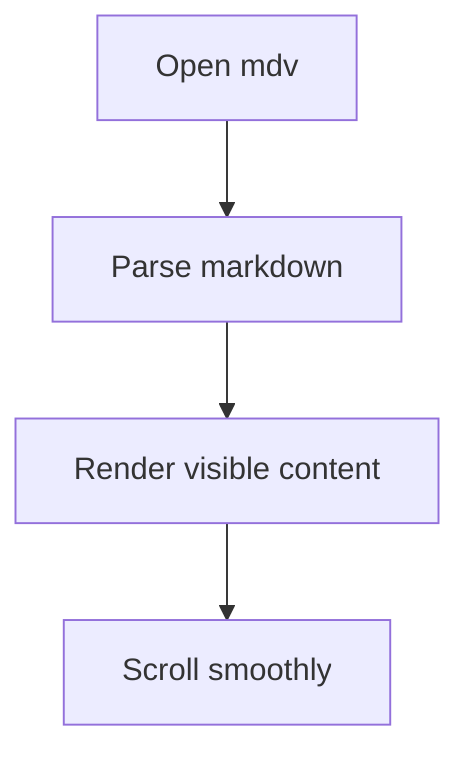

# Rich Markdown Fixture

Paragraph with *italic*, **bold**, ***bold italic***, ~~strikethrough~~, `inline code`, a [link](https://example.com), and an autolink <https://github.com>.

---

## Lists

- Bullet one
- Bullet two with `code`
  - Nested bullet
- [x] Completed task
- [ ] Pending task

1. Ordered item one
2. Ordered item two
3. Ordered item three

## Quote

> This is a blockquote.
> It spans multiple lines.

> [!NOTE]
> Callout parsed from blockquote syntax.

> [!TIP]
> Tip callout with a second paragraph.
>
> Still inside the same callout block.

> [!IMPORTANT]
> Important callout content.

> [!WARNING]
> Warning callout content.

> [!CAUTION]
> Caution callout content.

## Table

| Syntax | Example | Supported |
| --- | --- | --- |
| Emphasis | `*italic*` | Yes |
| Code fence | ```` ```rust ```` | Yes |
| Footnote | `[^1]` | Yes |

## Code

```rust
fn main() {
    println!("hello from mdv");
}
```

```json
{
  "name": "mdv",
  "type": "fixture",
  "features": ["callout", "mermaid", "image"]
}
```

## Mermaid



## Image


## Footnotes

Footnote reference[^details] and another reference[^second].

[^details]: The fixture keeps every high-value Markdown block in one document.
[^second]: Relative image paths should resolve next to this file.
